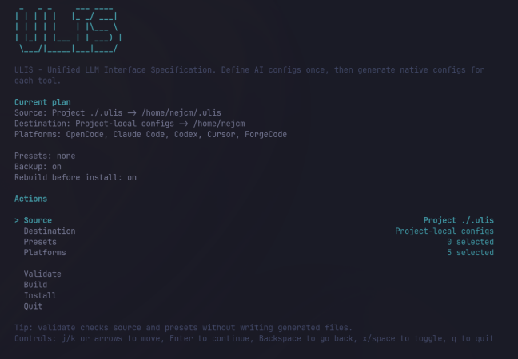

# ulis

> Unified LLM Interface Specification — one config source for AI tools.

`ulis` is a CLI that helps you write your agent configuration once, then publish it to:
[Claude Code](https://claude.ai/code), [OpenCode](https://opencode.ai), [Codex](https://github.com/openai/codex), [Cursor](https://cursor.com), and [ForgeCode](https://forgecode.dev/docs/).

**📖 Docs: [nejcm.github.io/ulis](https://nejcm.github.io/ulis/)**

Instead of maintaining separate "dialects" per platform, you keep a single canonical tree in `.ulis/` (per project) or `~/.ulis/` (global). Running `ulis` generates the native files each platform expects and installs them into the right locations.



---

## Install

```bash
npm i -g @nejcm/ulis
```

or

```bash
bun add -g @nejcm/ulis
```

Requires Node 20+. Works with both Node and Bun runtimes.

---

## Quick start — project mode

Scaffold a `.ulis/` folder inside an existing project:

```bash
cd my-project
ulis init
```

This creates:

```yaml
.ulis/
├── config.yaml          # version + project name
├── mcp.yaml             # MCP server definitions
├── permissions.yaml     # per-platform access rules
├── plugins.yaml         # Claude marketplace plugin installs
├── skills.yaml          # external skill installs (per platform)
├── agents/              # agent definitions (.md with frontmatter)
├── skills/              # skill definitions (SKILL.md per skill)
├── commands/            # slash commands
└── raw/                 # platform-specific fragments copied verbatim
```

It also appends `/.ulis/generated/` to `.gitignore`.

Add some agents/skills/MCP servers, then:

```bash
ulis install
```

This builds into `.ulis/generated/<platform>/` and then deploys to `./.claude/`, `./.codex/`, `./.cursor/`, `./.opencode/`, and ForgeCode locations (`./.forge/`) inside your project. Pass `-y` / `--yes` to skip confirmation prompts.

---

## Quick start — global mode

Maintain one canonical config for every project on your machine:

```bash
ulis init --global      # creates ~/.ulis/
# edit ~/.ulis/... to taste
ulis install --global   # deploys to ~/.claude/, ~/.codex/, ~/.cursor/, ~/.opencode/, ~/.forge/
```

---

## Common workflows

These patterns are independent; you can use project mode in some repos, global mode on the same machine, and presets whenever you want shared layers on top of a base source.

### Project-level configuration

Use this when agents, skills, or MCP servers should be **specific to one codebase** (or when your team wants the same setup for everyone who clones the repo).

1. Run `ulis init` at the repository root. That creates `./.ulis/` beside your code.
2. Edit YAML and add agents under `.ulis/agents/`, skills under `.ulis/skills/`, and so on.
3. Run `ulis install` (or `ulis install --yes` in scripts). Outputs land in `./.claude/`, `./.cursor/`, and the other tool folders **inside the project**.

You can commit `.ulis/` so the team shares one source of truth, and add `.ulis/generated/` (and optionally the generated tool dirs) to `.gitignore` if you prefer each developer to regenerate locally.

### Global configuration

Use this when you want **one personal baseline** that applies everywhere you work, without copying config into every repo.

1. Run `ulis init --global` once. That creates `~/.ulis/` in your home directory.
2. Maintain the same kind of tree as in project mode (`config.yaml`, `mcp.yaml`, `agents/`, …).
3. Run `ulis install --global`. Outputs go to `~/.claude/`, `~/.cursor/`, and the other **home-level** tool directories.

From any directory, `ulis build --global` / `ulis install --global` uses `~/.ulis/` as the source. To build a different tree but still install to home (for example a fork of your config in another path), use `ulis install --global --source /path/to/that/.ulis`.

### Presets as shared layers

**Presets** are mini `.ulis/`-shaped trees you apply **before** your base source on a given run. They are useful for stacks you reuse often (“our React defaults”, “backend service template”) without duplicating files in every repo.

- **User presets** live under `~/.ulis/presets/<name>/`. Each preset can include the same files and folders as a full source (`agents/`, `mcp.yaml`, …). Optional `preset.yaml` holds metadata (`name`, `description`) for `ulis preset list`.
- **Bundled presets** ship with the CLI (run `ulis preset list` to see names such as `react-web`, `backend`, `golang-backend`). If a name exists in both places, **your** `~/.ulis/presets/` copy wins.

Merge order is: first preset, second preset, …, then **your base source** (project `./.ulis/` or `~/.ulis/`). When the same agent or key appears in a preset and the base, **the base wins**.

```bash
ulis preset list
ulis install --preset react-web --yes              # base = ./.ulis/ in cwd
ulis install --global --preset backend --yes       # base = ~/.ulis/
ulis build --preset golang-backend,node-backend    # multiple presets, left to right
```

In CI or other non-interactive runs, add `--yes` so a missing preset name fails immediately instead of prompting.

---

## Commands

| Command        | Purpose                                                                  |
| -------------- | ------------------------------------------------------------------------ |
| `ulis init`    | Scaffold `.ulis/` in the current project (or `~/.ulis/` with `--global`) |
| `ulis build`   | Generate configs into `<source>/generated/` without installing           |
| `ulis install` | Build, then deploy generated configs to the target platform directories  |
| `ulis preset`  | List available presets from `~/.ulis/presets/`                           |
| `ulis tui`     | Launch the interactive dashboard for source, presets, build, and install |

### Common flags

| Flag                  | Applies to         | Description                                                                  |
| --------------------- | ------------------ | ---------------------------------------------------------------------------- |
| `-g`, `--global`      | all                | Operate on `~/.ulis/` and home-level install targets (`~/.claude/`…)         |
| `--source <path>`     | `build`, `install` | Override the source directory; with `--global`, installs still target home   |
| `--target <platform>` | `build`, `install` | Comma-separated list: `claude`, `codex`, `cursor`, `opencode`, `forgecode`   |
| `--preset <names>`    | `build`, `install` | Apply preset(s) from `~/.ulis/presets/` or bundled presets (comma-separated) |
| `-y`, `--yes`         | `install`          | Skip confirmation prompts                                                    |
| `--no-rebuild`        | `install`          | Skip the build step and deploy existing `generated/`                         |
| `--backup`            | `install`          | Back up existing platform dirs (`<dir>.backup.YYYYMMDD_HHMMSS`)              |

### Presets (quick reference)

See [Common workflows → Presets as shared layers](#presets-as-shared-layers) for a fuller explanation. Summary: presets merge **before** the base source (user `~/.ulis/presets/<name>/` overrides bundled names). Use `ulis preset list` to discover names.

```bash
ulis build --preset team-default
ulis install --preset team-default,react-web --yes
```

When `--yes` is set, missing presets fail fast with an error instead of prompting, which keeps CI runs non-interactive and deterministic.

### Source resolution

`ulis build` / `ulis install` pick the source directory in this order:

1. `--source <path>` if provided — fails if missing.
2. `--global` → `~/.ulis/` — fails with an `ulis init --global` hint if missing.
3. Otherwise → `./.ulis/` in the current directory (**no walk-up**) — fails with an `ulis init` hint if missing.

For `ulis install --source <path> --global`, the explicit source is built, then files are installed to home-level targets.

---

## Configuration files (`.ulis/`)

Your `.ulis/` tree is the single source of truth that `ulis` reads when you run `ulis build` / `ulis install`.

You can define:

- `config.yaml` – project identity
- `mcp.yaml` – MCP servers shared across platforms
- `permissions.yaml` – per-platform read/write/bash access rules
- `plugins.yaml` – Claude Code marketplace plugins
- `skills.yaml` – external skill installs
- `agents/*.md` – agents (prompt + frontmatter)
- `skills/<name>/SKILL.md` – skills
- `commands/` and `raw/` – pass-through fragments copied into generated outputs

For the full field-level schema and examples, see [docs/REFERENCE.md](docs/REFERENCE.md). For architecture, see [docs/SPEC.md](docs/SPEC.md).

---

## Install behaviour

| Tool        | Strategy         | Target (project mode) | Target (global mode) |
| ----------- | ---------------- | --------------------- | -------------------- |
| OpenCode    | Overwrite        | `./.opencode/`        | `~/.opencode/`       |
| Claude Code | Merge (additive) | `./.claude/`          | `~/.claude/`         |
| Codex       | Overwrite        | `./.codex/`           | `~/.codex/`          |
| Cursor      | Merge (additive) | `./.cursor/`          | `~/.cursor/`         |
| ForgeCode   | Merge (additive) | `./.forge/`           | `~/.forge/`          |

`settings.json`, `.claude.json`, `mcp.json`, and ForgeCode's `.forge/.mcp.json` are deep-merged so user content outside `ulis`-managed keys is preserved. With `--backup`, existing platform directories/files are copied aside before overwriting.

---

## Schema autocomplete

Scaffolded YAML files include a `# yaml-language-server: $schema=…` header pointing at `./node_modules/@nejcm/ulis/dist/schemas/*.schema.json`. VS Code's YAML extension picks these up automatically when the package is installed.

Schemas are also regenerated on every `npm run build` via `bun run gen:schemas`.

---

## Contributing & Development

Want to build on `ulis` itself? These scripts help you run the CLI locally, regenerate generated assets, and verify changes with the test suite.

Clone the repo:

```bash
bun install
bun run dev        # builds against example/
bun test           # runs the suite (~96 tests)
bun run build      # bundles dist/cli.js + regenerates dist/schemas
```

### Dev scripts

| Script                  | Purpose                                                             |
| ----------------------- | ------------------------------------------------------------------- |
| `bun run build`         | Bundle CLI (`tsup`) and regenerate JSON schemas                     |
| `bun run dev`           | Run `ulis build` against the `example/` directory                   |
| `bun run ulis <args>`   | Run the CLI from source (`tsx src/cli.ts …`)                        |
| `bun run tui`           | Launch the interactive TUI from source                              |
| `bun run test`          | Run the unit + integration suite                                    |
| `bun run lint`          | `tsc --noEmit`                                                      |
| `bun run format`        | Format with [oxfmt](https://oxc.rs/docs/guide/usage/formatter.html) |
| `bun run gen:schemas`   | Regenerate `dist/schemas/*.schema.json` from Zod                    |
| `bun run gen:reference` | Regenerate `docs/REFERENCE.md`                                      |

### Repo layout

```yaml
src/
  cli.ts                   # cac entry point (compiled to dist/cli.js)
  commands/                # init, install, build, tui
  parsers/                 # agent, skill, mcp, plugins, permissions loaders
  generators/              # claude, opencode, codex, cursor, forgecode
  schema/                  # Zod schemas (ulis-config, agent, mcp, …)
  scaffold/                # inline templates used by `ulis init`
  tui/                     # TUI dashboard state/actions/render modules
  utils/                   # config-loader, resolve-source, fs, logger, …
  validators/              # cross-ref + collision checks
  tui.ts                   # TUI entrypoint + effect runner
  tools/                   # gen-json-schema, gen-reference
example/                   # reference example config
tests/
docs/
  SPEC.md                  # architecture + entity model
  REFERENCE.md             # auto-generated field reference
```

### Testing

The `bun run dev` command builds against `example/` so the CLI works without any `.ulis/` in the current directory.
The `bun run dev:install --source example` command installs the example into global configs.

---

## Docs

- [docs/SPEC.md](docs/SPEC.md) — architecture, entity model, capability matrix, versioning, extension guide.
- [docs/REFERENCE.md](docs/REFERENCE.md) — auto-generated field reference for every schema.
- [docs/CLI.md](docs/CLI.md) — full CLI reference (commands, flags, exit codes, examples).

---

## License

ISC
